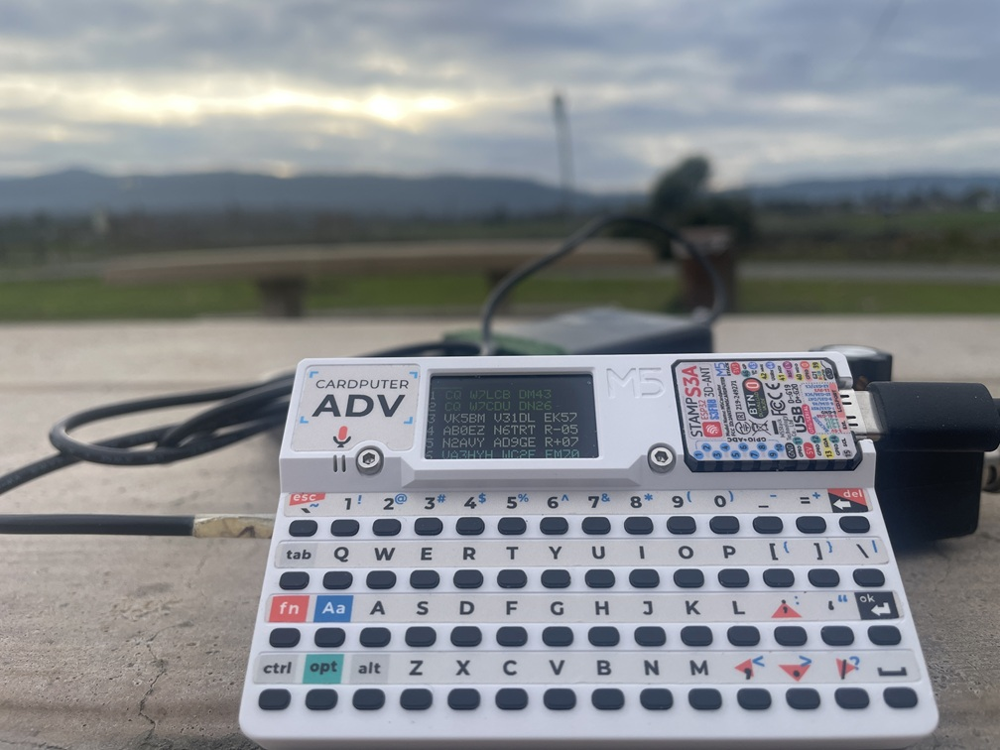

# First POTA activation (v1.0 2025-12-31)

## Mini-FT8 Release Notice
It currently supports QMX only, truSDX and KH1 support will come later.

### Thanks
  - DX-FT8 team: Barb (WB2CBA), Charley (W5BAA) and Paul (G8KIG)
  - Zhenxing (N6HAN) — big help getting past obstacles (especially UAC)
  - Karlis Goba — ft8 library

### Hardware
(I have no affiliation with the vendor.)
  - Must order: https://shop.m5stack.com/products/m5stack-cardputer-adv-version-esp32-s3
  - Optional:https://shop.m5stack.com/products/4pin-buckled-grove-cable
(for a homebrew serial cable, or for charging when operating long time since USB-C is occupied by QMX)

73

Wei AG6AQ
